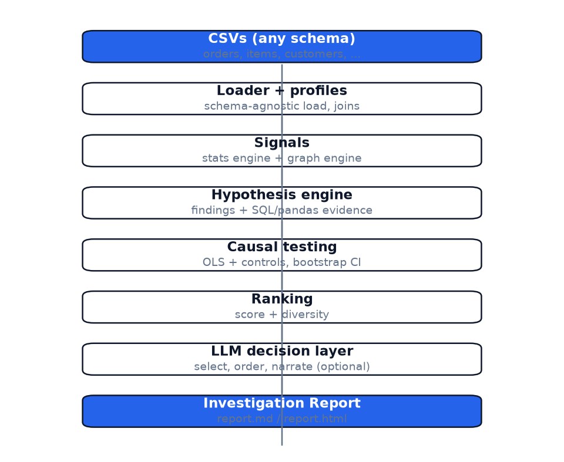
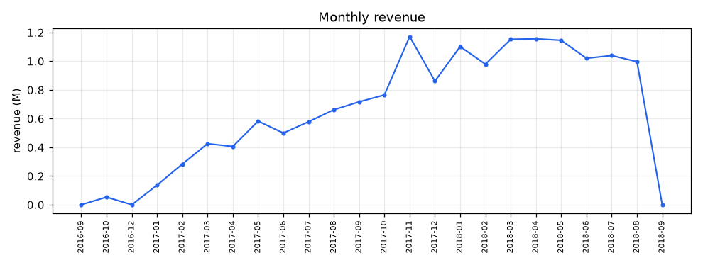
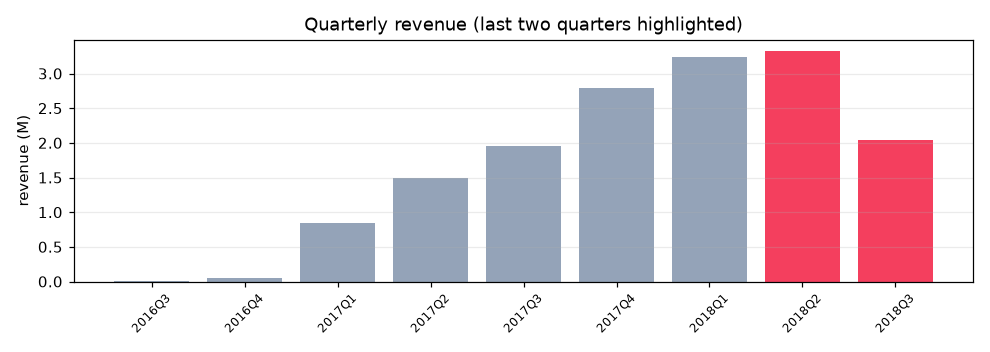

# DataInvestigator

Turns a folder of CSVs into an investigation report. It looks for the kind of
things you'd want flagged in sales data: a revenue drop in a quarter, a category
that over-indexes in one region, an unusual month, or categories that get bought
together. Instead of just printing a number, every finding ships with the SQL
(and a small pandas snippet) used to compute it, so you can re-check the numbers
by hand.

I built this as a final-year major project. The starting gripe was that BI
dashboards tell you *what* happened, not *what deserves attention* or whether an
effect still shows up once you control for obvious confounders.

## Quick start

Requires Python 3.12 and `uv`.

```
uv sync
cp .env.example .env        # only needed for the LLM step
uv run python scripts/download_olist.py
uv run investigator --data data/raw/olist --out reports/
```

That leaves you `reports/report.md` and `reports/report.html` (single file, charts
and SQL inlined). To run without calling any API, which also skips the LLM step:

```
uv run investigator --data data/raw/olist --no-llm --out reports/
```

## How it works

data -> loader/profile -> stats + graph signals -> hypothesis engine -> causal
check -> ranking -> [LLM] -> report



Everything up to ranking is deterministic, and it stays that way: same data in,
same findings out. The LLM (OpenRouter, default `openai/gpt-4o-mini`) is the only
non-deterministic part. It gets the already-computed numbers, evidence and causal
verdicts, and its only jobs are to pick which findings to surface, order them, and
explain them. If there's no API key, a templated fallback does the same thing, so
the LLM is optional rather than load-bearing.

Each finding carries two pieces of reproducible evidence:

- SQL run against DuckDB views of the raw CSVs
- a pandas one-liner that recomputes the headline number

A finding is marked "verified" when the SQL result matches the engine's number
within a small tolerance. That cross-check is the reason to believe the numbers
at all.

Reading the code? The files that matter:

- `src/investigator/loader.py` - reads the CSVs and canonicalizes names. It is
  deliberately not tied to one schema: the Spanish-named retail dataset generated
  by `scripts/synth_retail.py` goes through the same code path as Olist.
- `src/investigator/hypothesis_engine.py` - turns the statistical and graph
  signals into findings plus the SQL evidence.
- `src/investigator/causal_engine.py` - OLS with controls, bootstrap CI, and an
  optional PC skeleton. Outputs `supported / confounded / spurious /
  insufficient_data`; small tables usually land on the last one, which is an
  honest "can't tell", not a result.
- `src/investigator/llm_reporter.py` - the decision layer described above.
- `scripts/evaluate.py` - the ground-truth harness below.

## Does it actually find anything?

Two answers.

On the real Olist dataset, the top finding is genuine and cross-verified: revenue
fell about 40% in Q3 2018, concentrated in São Paulo, with the drill-down chain
and SQL in the report. For context, here is what the underlying series look like
(the same charts end up in every report):





There is also a ground-truth evaluation. `scripts/synth_data.py` generates fake
data with three anomalies planted at known spots: a quarterly revenue drop, a
furniture-over-index in a single state, and a one-month price spike. The harness
runs the full pipeline on clean and injected copies, and passes only when all
three are recovered and none appears on the clean copy:

```
uv run python -m scripts.evaluate --orders 700 --customers 3500
```

Currently 3/3 recovered, 0 ghosted, seed 42. This eval has already caught real
bugs during development: an unseeded random draw made the dataset different on
every run, and a matcher that ignored spike direction treated a clean-data dip as
the injected spike.

## Tests

```
uv sync --extra dev
uv run pytest
```

The suite is 40 tests across unit, integration (Olist), the ground-truth eval, and
the retail-schema loader test. Slow ones are tagged `slow`.

## Reproducibility

This was a pain point, so it's handled explicitly: every RNG in the code and in
the data generators is seeded, the pipeline itself has no randomness, and the
Dockerfile pins the uv lock. CI (`.github/workflows/ci.yml`) runs the full suite
and the ground-truth eval on every push.

See the `Makefile` for short targets: `make setup`, `make test`, `make eval`,
`make report`, `make report-llm`.

## Docs

- `docs/design.md` - pipeline stages and design decisions
- `docs/evaluation.md` - ground-truth methodology, results and limits

## Known limitations

- The ground-truth eval proves the three planted anomalies are recoverable on the
  fixed seed; it does not give a false-positive rate over many seeds.
- Causal claims are only as good as the panel size; small data gives
  `insufficient_data`, deliberately.
- LLM output is judged qualitatively, not scored. The numbers it quotes are
  protected by the verified-evidence layer, but the prose itself is just prose.